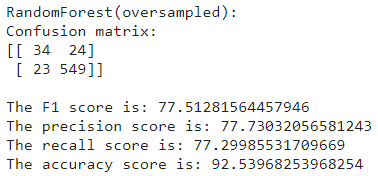

# Sentiment Analysis Using Machine Learning Models
> Dataset: [Amazon Alexa Reviews](https://www.kaggle.com/code/rishabh2007/89-acc-alexa-reviews-sentimnent-analysis/data)

### We will compare and the best ml model in our exact case which is analyzing alexa reviews and deciding whether its positive review or negative review.

## Dealing with data:

### Downloading data and importing it into pandas data frame:

After download the data which came in tsv (tab-seperated-file) format, we will load the data as pandas series while specifying the delimiter as '\t'.

```python
df = pd.read_csv(filename, sep='\t')
```

### Overlook on the data:
After loading the data we will check the size of the data (3150,5) and the format of the data.


Since we are interested in the feedback and the review only we can drop the rest of the columns.


### Graphs and statistics:
Now we can start inspecting the data.


From the above data we can notice that the data is very heavily biased towards the positive reviews (above 91%), this can cause problems in our model later on so we will have to deal with it before passing the data to the model.

### Cleaning data:

##### Stop words:
First we need to remove vocab that will be of no use to us, so we remove all stopwords excepts for 'not' and 'nor' since they can change positive sentiment to negative one.

##### Digits, Case and Marks:
We can remove all digits and marks since even though marks can emphazise that someone is really angry or really excited it doesnt affect our scope that is to classify review into positive and negative without ranking the levels of positivity or negativity. Same goes for Upper case.

##### Stemming:
We can use stemming to significantly reduce our vocab by removing all the alike words into one word ("better" &rarr; "good").


### Vectorizing the data:

1. Count Vectorizing.
1. TFIDF Vectorizing.

> we will use both and compare results.


### Splitting data:
We will use 80-20 split for our data.


### Dealing with biases:

> There is 3 ways we are going to tackle this problem.

1. Modifying class weight of the model.
> for this we dont need to modify any of the data so we will skip it for now.

1. OverSampling.
> we can generate more samples of the minority (negative) to match the number of the majority (positive).

1. UnderSampling.
> we can get rid of some of the majority (positive) in order to match the count of the minority (negative).


## Machine Learning Models:

> We will make 4 different models for each ml method.

### SVM (Support-Vector-Machine):


1. Baseline model.
> this model wasnt modified in any means.
> > 

1. Balanced model.
> this model had class weight set to balanced.
> > 

1. OverSampled model.
> this was trained using oversampled data.
> > 

1. UnderSampled model.
> this trained using UnderSampled model.
> > 


### Random Forest:


1. Baseline model.
> this model wasnt modified in any means.
> > 

1. Balanced model.
> this model had class weight set to balanced.
> > 

1. OverSampled model.
> this was trained using oversampled data.
> > 

1. UnderSampled model.
> this trained using UnderSampled model.
> > 


## Metrics and Observations:

> We will use the F1 metric as our main metric since it we are interested in the false and true positives as well as the false negative.

### Best Models:

* SVM Balanced:

* SVM Over sampled:

* Random Forest Over sampled:

